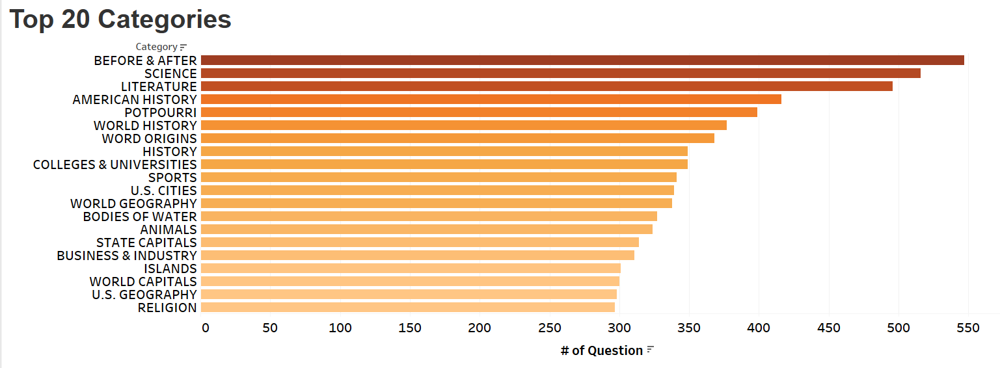

# Jeopardy Questions: Topic Modeling

Louisa Reilly

## Abstract:
The overarching goal of this project was to discern more generalizable topics, so future Jeopardy contestants know what to prioritize when preparing to audition or be on the show. The game show is notorious for emphasizing breadth vs depth. After using NMF for topic modeling, this became evident, as the model needed 100 topics to create some discernable categories. Even then, the top category was mostly more general knowledge with a focus on history and geography. After some exploratory data analysis, it revealed that history and geography were in the top 20 of categories. Interestingly, some of the most popular categories were a hodge-podge of questions from 'Potpurri' and 'Before and After'.

## Design:
Jeopardy is an American TV game show that features a quiz competition where the contestants are presneted with general knowledge clues as answers, and they have to rephrase their responses in a question format. Contestants historically study intensively for the competetion by quizzing themselves on previous questions and learning about a wide variety of different topics. The show emphasizes breadth over depth, as well as certain topics such as art, history, pop culture, science etc. Each question set has its own niche category.

I am interested in separating out the very niche categories of Jeopardy questions into more general subjects via topic modeling.

## Data:
A set of over 200,000 [Jeopardy questions](https://www.reddit.com/r/datasets/comments/1uyd0t/200000_jeopardy_questions_in_a_json_file/) posted on the subreddit r/datasets.
They were obtained via webcrawling on [J! Archive](https://www.j-archive.com/) by the reddit user *u/trexmate*.
- Exactly 216,930 questions and answers are in this dataset.
- In addition to the questions and answers, each row one has their category, $ value, round, show number, and air date.
- The dataset needs to be cleaned as there are some html tags present.

## Algorithms:
Because the documents are so short, it is very noise sensitive. Thus, text preprocessing was crucial to remove stop word, some of which were removed later when they were found to be contributing to the noise of the dataset. Additionally, puncutation, excess html tags, and hyperlinks were also removed. It was found that lemmatizing the text improved preformance slightly.

Topic modeling was preformed using NMF. Multiple topic numbers were tested as follows: 2, 10, 20, 30, 40, 50, 75, 100,and 250. It was found that topics became more discernable around 100. Consistently, the first topic had much higher word scores, by a factor of 100 or more. However, as more the number of topics increased, the word scores of topic 1 did decrease exponentially, as shown below.

It was not surprising that history and geography were combined in the first topic since those questions are more prevalent in the dataset. As shown below.

Finally, it made sense that the more discernable topics were science and arts because they were also in the top 20. 

## Tools: 
- Python text processing librariers: NLTK and sklearn.
- Numpy, pandas, and regex were used for some of the processing.
- Visualization via Tableau and some use of seaborn/ matplotlib.

## Communication:
- [Tableau Sheets](https://public.tableau.com/app/profile/louisa.reilly/viz/jeopardy_questions/word_scores?publish=yes) 